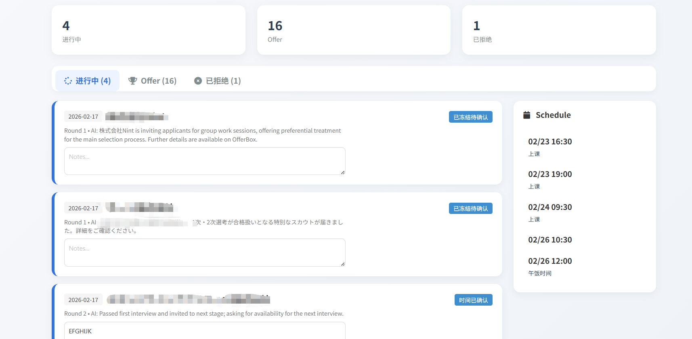
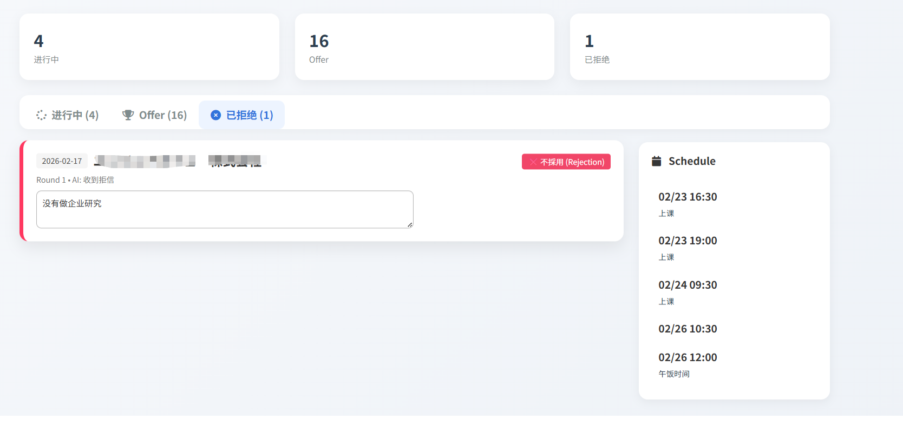
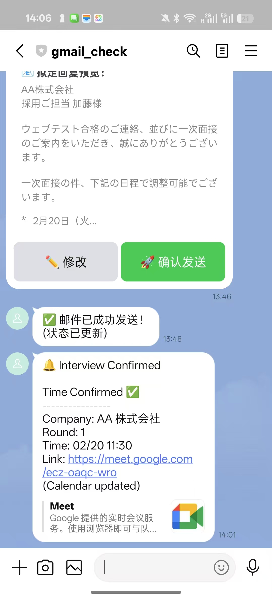
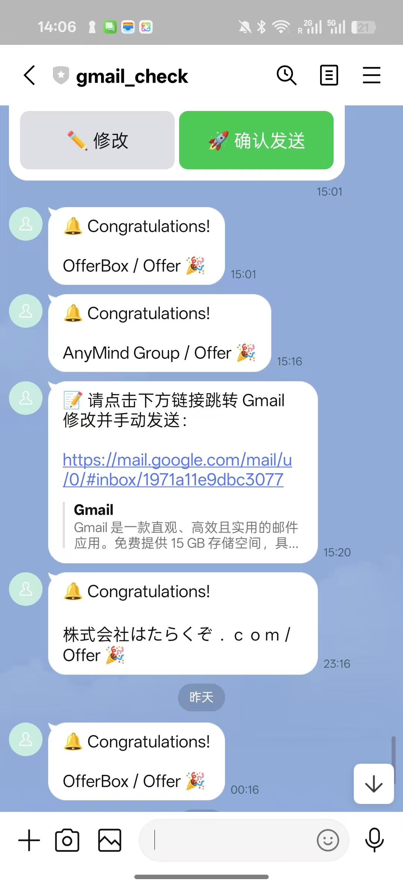

# 🤖 AI 面试管理系统 (Interview Management)

基于 Google Apps Script 的全自动面试流程管理工具。通过 Gmail + Gemini AI + Google Calendar + LINE Bot 实现：自动读取面试邮件 → AI 分析意图 → 智能排期 → 自动生成回复草稿 → LINE 通知确认 → 一键发送。

## 📸 效果展示

<p align="center">
  
  
</p>
<p align="center">
  
  
</p>

---

## ⚠️ 敏感信息说明

本仓库中的 `Config/Config.js` 使用了**占位符**，不包含任何真实的 API Key 或 Token。克隆后需要自行填入以下敏感配置：

| 占位符 | 说明 | 获取方式 |
|---|---|---|
| `your gemini api key here` | Gemini API 密钥 | [Google AI Studio](https://aistudio.google.com/apikey) |
| `your line channel token here` | LINE Channel Access Token | [LINE Developers Console](https://developers.line.biz/console/) |
| `your user id here` | 你的 LINE User ID（以 `U` 开头） | LINE Developers Console → Basic settings |

> 🔒 **切勿将真实密钥提交到 Git 仓库！** 建议使用 GAS 的 Script Properties 存储敏感信息（详见第五步）。

---

## 📁 项目结构

```
interviewmanagement/
├── appsscript.json              # GAS 项目配置
├── Index.html.html              # Web Dashboard 前端 (Vue.js + Bulma)
├── test.gs.js                   # 环境测试脚本
├── Config/
│   └── Config.js                # 全局配置 (API Key, Token 等)
├── Business_Logic/
│   └── Workflow_Main.gs.js      # 核心业务逻辑 (邮件处理 Pipeline)
├── Core_Services/
│   ├── Service_Calendar.gs.js   # Google Calendar 服务 (查空闲/冻结/解冻)
│   ├── Service_Gemini.gs.js     # Gemini AI 服务 (邮件分析/草稿生成)
│   ├── Service_Sheet.gs.js      # Google Sheets 数据库服务
│   └── Service_User.gs.js       # 用户配置与日程服务
├── Interface/
│   ├── Controller_Line.gs.js    # LINE Bot 交互控制器 (Webhook + Push)
│   └── Controller_Web.gs.js     # Web Dashboard 后端 API
```

---

## 🔧 前提准备

### 需要的 Google 账号权限
- Gmail（读取/发送邮件、管理标签）
- Google Calendar（创建/删除/修改事件）
- Google Sheets（数据存储）
- Google Apps Script（运行脚本）

---

## 📋 配置步骤

### 第一步：获取 Gemini API Key

1. 访问 [Google AI Studio](https://aistudio.google.com/apikey)
2. 登录你的 Google 账号
3. 点击 **"Create API Key"**
4. 选择一个 GCP 项目（或创建新项目）
5. 复制生成的 API Key，后续填入 `Config.js` 的 `GEMINI_API_KEY`

> ⚠️ Gemini API 有免费额度，个人使用通常足够。本项目使用的模型是 `gemini-2.5-flash`。

---

### 第二步：创建 LINE Channel（Messaging API）

#### 2.1 注册 LINE Developers 账号

1. 访问 [LINE Developers Console](https://developers.line.biz/console/)
2. 使用你的 LINE 账号登录
3. 如果是首次使用，需要创建一个 **Provider**（提供者），名称随意，例如 `MyInterviewBot`

#### 2.2 创建 Messaging API Channel

1. 在你的 Provider 下，点击 **"Create a new channel"**
2. 选择 **"Messaging API"**
3. 填写必要信息：
   - **Channel name**: `面试管理Bot`（或任意名称）
   - **Channel description**: `自动面试流程管理`
   - **Category / Subcategory**: 随意选择
   - **Email**: 你的邮箱
4. 同意条款后点击 **Create**

#### 2.3 获取 Channel Access Token

1. 进入刚创建的 Channel 页面
2. 切换到 **"Messaging API"** 标签页
3. 滚动到底部，找到 **"Channel access token (long-lived)"**
4. 点击 **"Issue"** 生成 Token
5. 复制 Token → 填入 `Config.js` 的 `LINE_CHANNEL_TOKEN`

#### 2.4 获取你的 LINE User ID

1. 在同一页面的 **"Messaging API"** 标签下
2. 顶部可以看到一个 **Bot basic ID** 和 **QR Code**
3. 用手机 LINE 扫描该 QR Code，添加这个 Bot 为好友
4. 回到 LINE Developers Console，切换到 **"Basic settings"** 标签
5. 底部找到 **"Your user ID"**（以 `U` 开头的字符串）
6. 复制 → 填入 `Config.js` 的 `USER_ID_LINE`

#### 2.5 配置 Webhook URL（部署后设置）

> 此步骤需要在 GAS 部署完成后回来设置。

1. 在 **"Messaging API"** 标签页找到 **"Webhook settings"**
2. 将 **Webhook URL** 设置为你的 GAS Web App URL（格式如：`https://script.google.com/macros/s/xxxxxxx/exec`）
3. 打开 **"Use webhook"** 开关
4. 点击 **"Verify"** 测试连接

#### 2.6 关闭自动回复（重要！）

1. 在 **"Messaging API"** 标签页找到 **"LINE Official Account features"**
2. 点击 **"Auto-reply messages"** 旁的 **Edit** 链接
3. 将自动回复设置为 **关闭（Disabled）**
4. 将 **Greeting messages** 也设为关闭（可选）

---

### 第三步：创建 Google Sheets 数据库

1. 新建一个 Google Sheets 表格
2. 创建以下工作表（Sheet Tab）：

#### 工作表 1: `DB_Applications`
| 列 | 字段名 | 说明 |
|---|---|---|
| A | Timestamp | 记录时间 |
| B | Company | 公司名 |
| C | Status | 当前状态 |
| D | Thread_ID | Gmail 邮件会话 ID |
| E | Round_Count | 面试轮次 |
| F | Slot_IDs | 日历事件 ID (JSON) |
| G | Meeting_Link | 面试链接 |
| H | Summary | AI 摘要 |
| I | Confirmed_Time | 确认的面试时间 |
| J | Notes | 备注 |

#### 工作表 2: `DB_Config`
| A 列 (Key) | B 列 (Value) | 说明 |
|---|---|---|
| USER_NAME | 你的名字 | 用于生成回复邮件的署名 |
| MIN_NOTICE_HOURS | 24 | 最少提前多少小时安排面试 |
| SLOT_INTERVAL_MIN | 60 | 两个候选时段之间的最小间隔（分钟） |
| INTERVIEW_DURATION | 60 | 默认面试时长（分钟） |

#### 工作表 3: `DB_Logs`
| 列 | 字段名 | 说明 |
|---|---|---|
| A | Timestamp | 日志时间 |
| B | Status | 状态码 |
| C | Source | 来源 |
| D | Message | 详细信息 |

3. 记下该 Google Sheets 的 **Spreadsheet ID**（URL 中 `/d/` 和 `/edit` 之间的字符串）

---

### 第四步：创建 Google Apps Script 项目

#### 方式 A：通过 Sheets 绑定创建（推荐）

1. 打开你刚创建的 Google Sheets
2. 点击菜单栏 **扩展程序 (Extensions)** → **Apps Script**
3. 这会自动创建一个绑定该 Sheets 的 GAS 项目
4. 好处：`SpreadsheetApp.getActiveSpreadsheet()` 自动指向该 Sheets，无需手动填 `SHEET_ID`

#### 方式 B：通过 clasp 推送（本项目方式）

1. 安装 clasp：
   ```bash
   npm install -g @google/clasp
   ```
2. 登录：
   ```bash
   clasp login
   ```
3. 克隆项目（如果已有 GAS 项目）：
   ```bash
   clasp clone <Script ID>
   ```
4. 或创建新项目后推送：
   ```bash
   clasp create --type webapp --title "Interview Management"
   clasp push
   ```

---

### 第五步：填写配置文件

编辑 `Config/Config.js`，填入你自己的值：

```javascript
const CONFIG = {
  // === 敏感信息 ===
  GEMINI_API_KEY: '你的 Gemini API Key',
  LINE_CHANNEL_TOKEN: '你的 LINE Channel Access Token',

  // === 业务配置 ===
  SHEET_ID: SpreadsheetApp.getActiveSpreadsheet().getId(), // 绑定式默认可用
  CALENDAR_ID: 'primary',          // 使用默认日历，或填指定日历 ID
  USER_ID_LINE: 'U...你的LINE用户ID',

  // === 规则配置 ===
  INTERVIEW_DURATION: 60,   // 面试时长 (分钟)
  WORK_START_HOUR: 10,      // 工作日开始时间
  WORK_END_HOUR: 19,        // 工作日结束时间
  SLOT_INTERVAL_MIN: 30,    // 候选时段间隔 (分钟)
  DELAY_DAYS: 0,            // N天后开始搜索空闲
  CHECK_DAYS_AHEAD: 7       // 搜索未来几天
};
```

> 💡 **安全建议**：正式使用时，建议将 `GEMINI_API_KEY` 和 `LINE_CHANNEL_TOKEN` 存入 GAS 的 **Script Properties** 中：
> - 在 GAS 编辑器中 → ⚙️ 项目设置 → 脚本属性 → 添加键值对
> - 代码中通过 `PropertiesService.getScriptProperties().getProperty('KEY_NAME')` 读取

---

### 第六步：启用 Google APIs

在 GAS 编辑器中确保以下服务已开启：

1. 点击左侧 **"服务 (Services)"** 的 `+` 号
2. 启用以下 API（如果列表中有的话）：
   - **Gmail API** — 通常 GAS 内置，无需额外添加
   - **Calendar API** — 通常 GAS 内置
   - **Sheets API** — 通常 GAS 内置

> GAS 使用内置的 `GmailApp`、`CalendarApp`、`SpreadsheetApp` 服务，通常不需要额外启用高级服务。首次运行时会弹出权限授权窗口，点击 **允许** 即可。

Gemini API 通过 `UrlFetchApp` 的 HTTP 请求调用，无需在 GAS 中额外启用。

---

### 第七步：设置定时触发器

核心函数 `main_autoRecruit_pipeline()` 需要定时触发：

1. 在 GAS 编辑器中，点击左侧 **⏰ 触发器 (Triggers)**
2. 点击 **"+ 添加触发器"**
3. 配置如下：
   - **选择函数**: `main_autoRecruit_pipeline`
   - **部署**: `Head`
   - **事件来源**: `时间驱动 (Time-driven)`
   - **类型**: `分钟定时器 (Minutes timer)`
   - **间隔**: `每 10 分钟`
4. 点击 **保存**

---

### 第八步：部署 Web App

1. 在 GAS 编辑器中，点击右上角 **"部署 (Deploy)"** → **"新建部署 (New deployment)"**
2. 点击齿轮图标，选择 **"Web 应用 (Web app)"**
3. 配置：
   - **描述**: `Interview Dashboard v1`
   - **执行身份 (Execute as)**: `我 (Me)`
   - **访问权限 (Who has access)**: `任何人 (Anyone)`（LINE Webhook 需要）
4. 点击 **"部署 (Deploy)"**
5. 复制生成的 **Web App URL**

---

### 第九步：回填 Webhook URL

1. 回到 [LINE Developers Console](https://developers.line.biz/console/)
2. 进入你的 Channel → **Messaging API** 标签
3. 将 **Webhook URL** 设置为第八步获得的 Web App URL
4. 点击 **Verify** 确认连接成功
5. 确保 **Use webhook** 开关已打开

---

## ✅ 验证部署

### 测试 1：环境检查
在 GAS 编辑器中运行 `simpleTest()` 函数，查看日志输出是否正常。

### 测试 2：Dashboard
在浏览器中访问你的 Web App URL，应该可以看到面试看板界面。

### 测试 3：LINE Bot
向你的 LINE Bot 发送一条消息（虽然不会回复，但不应报错）。

### 测试 4：邮件处理 Pipeline
手动运行 `main_autoRecruit_pipeline()`，查看执行日志中是否有报错。

---

## 🔄 工作流程说明

```
Gmail 收到面试邮件
       ↓
定时触发器 (每10分钟) 运行 main_autoRecruit_pipeline()
       ↓
搜索未读邮件 (标题含"面试/interview/選考")
       ↓
Gemini AI 分析邮件意图
       ↓
  ┌─── OFFER ────→ 记录到 Sheet + LINE 通知 🎉
  ├─── REJECTION ─→ 记录到 Sheet
  ├─── CONFIRMATION → 解冻日历 + 更新记录 + LINE 通知
  ├─── INVITATION ──→ 查空闲 → 冻结日历 → 生成回复草稿
  │                    → LINE 发送 Flex Message (带确认/修改按钮)
  └─── OTHER ─────→ 跳过
       ↓
用户在 LINE 上点击"确认发送" → 自动发送邮件草稿
       ↓
Web Dashboard 实时查看所有面试状态
```

---

## 🛠️ 常见问题

### Q: 首次运行提示权限错误？
A: 首次执行时 Google 会弹出授权窗口，需要授予 Gmail、Calendar、Sheets 的访问权限。点击"高级" → "前往 xxx（不安全）" → "允许"。

### Q: LINE Webhook Verify 失败？
A: 确保部署时"访问权限"选择了"任何人 (Anyone)"，且 URL 末尾是 `/exec` 而不是 `/dev`。

### Q: Gemini API 返回错误？
A: 检查 API Key 是否正确、是否有额度。可以在 [Google AI Studio](https://aistudio.google.com/) 中直接测试你的 Key。

### Q: 邮件没有被处理？
A: 检查邮件标题是否包含 `選考`、`interview`、`面试` 等关键词，且邮件状态为**未读**。处理过的邮件会被打上 `已处理` 标签。

### Q: 更新代码后 LINE Webhook 不生效？
A: 每次修改代码后需要重新部署（**新建部署，而非更新旧部署**），并将新的 URL 更新到 LINE Developers Console 的 Webhook 设置中。

---

## 📌 使用的外部 API 清单

| API / 服务 | 用途 | 费用 |
|---|---|---|
| [Gemini API](https://ai.google.dev/) | 邮件意图分析、回复草稿生成 | 免费额度（个人够用） |
| [LINE Messaging API](https://developers.line.biz/) | 推送通知、接收用户操作 | 免费（消息数有限额） |
| Gmail (GAS 内置) | 读取面试邮件、发送回复 | 免费 |
| Google Calendar (GAS 内置) | 管理面试日程 | 免费 |
| Google Sheets (GAS 内置) | 数据持久化存储 | 免费 |
